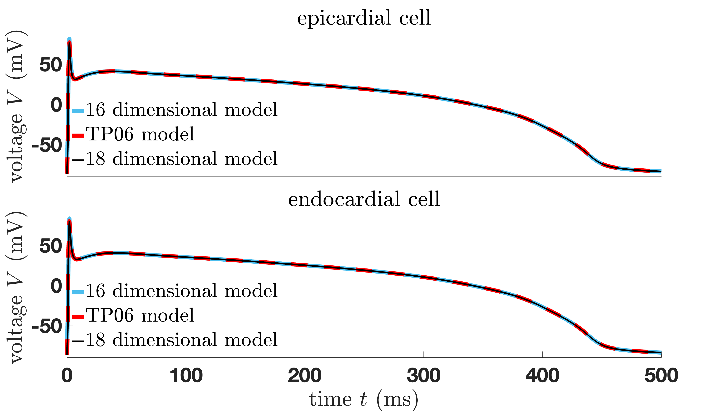
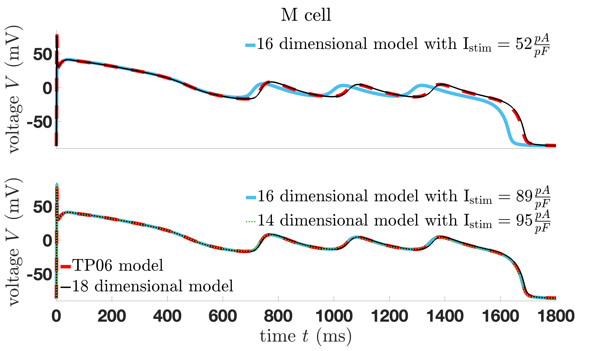

## Description 

In this folder the provide the Matlab files for the TP06 model `fun_TP06_model` and its modified versions (14-dimensional `fun_mofidifed_TP06_epi_M_endo_14d`, 16-dimensional `fun_mofidifed_TP06_epi_M_endo_16d` and 18-dimensional `fun_mofidifed_TP06_epi_M_endo_18d`). In addition, a main file `simulation_mofidifed_TP06_epi_M_endo` is provided, which one has to run to produce the two following comparing plots:

These plots are also the one included in our manuscript.
